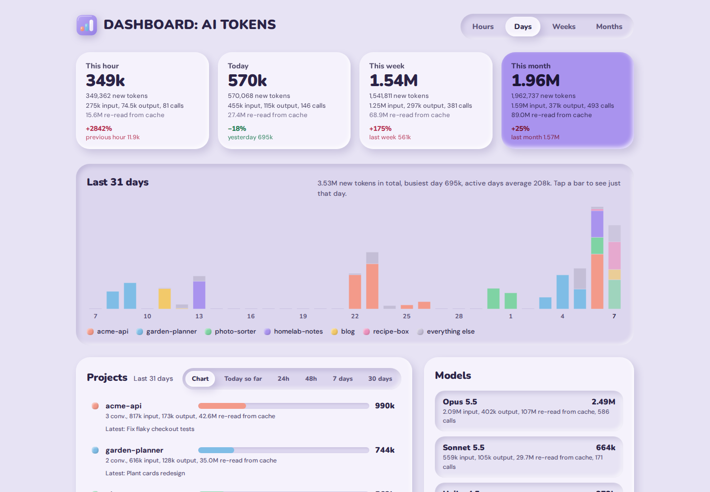
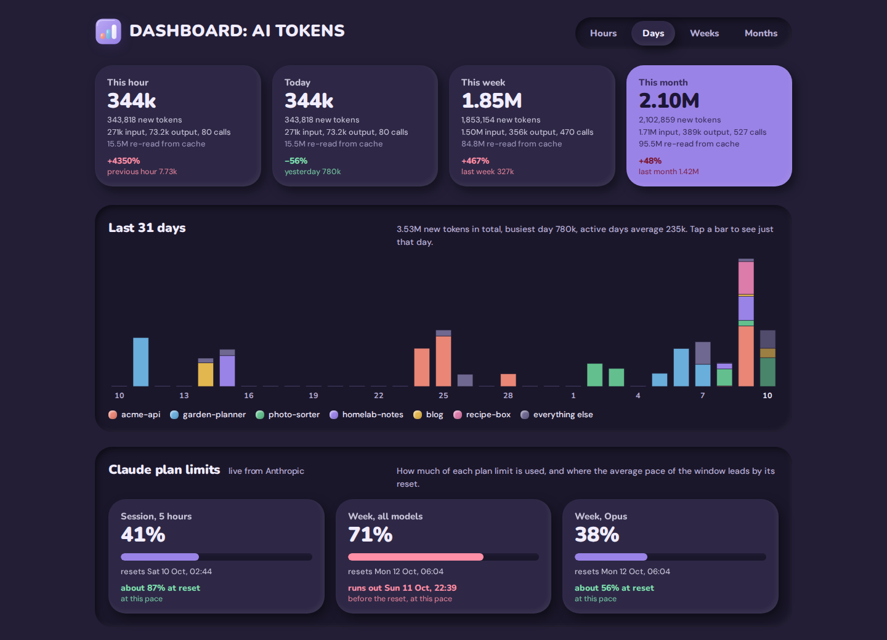
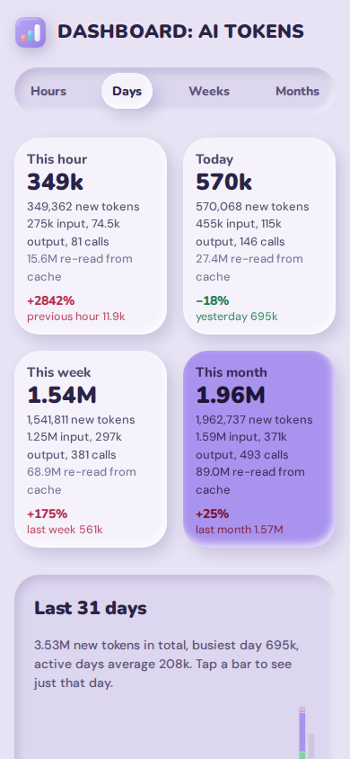
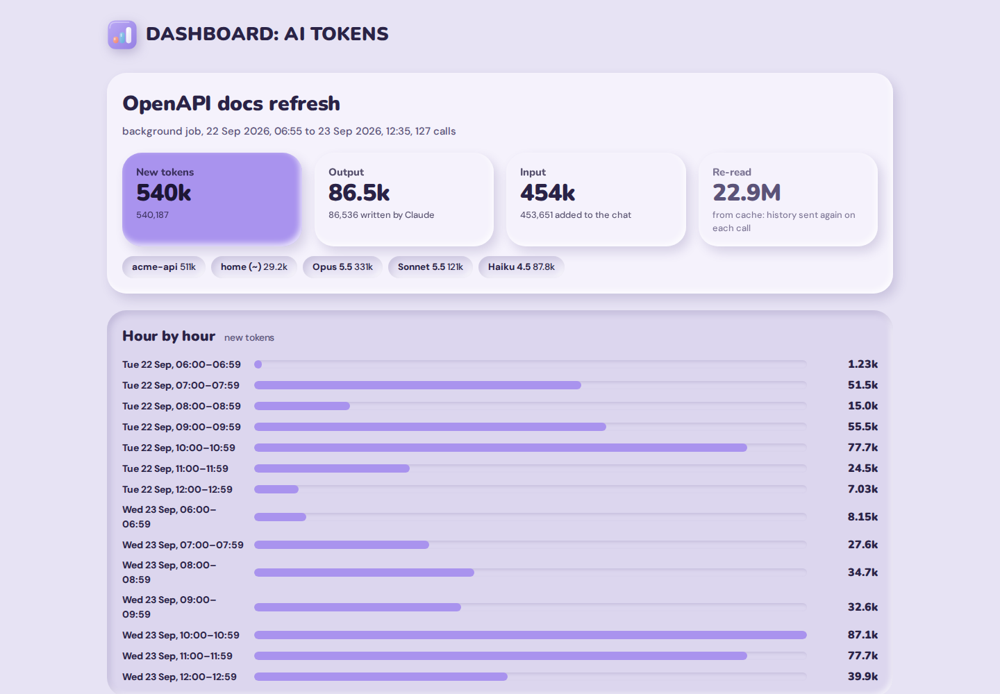
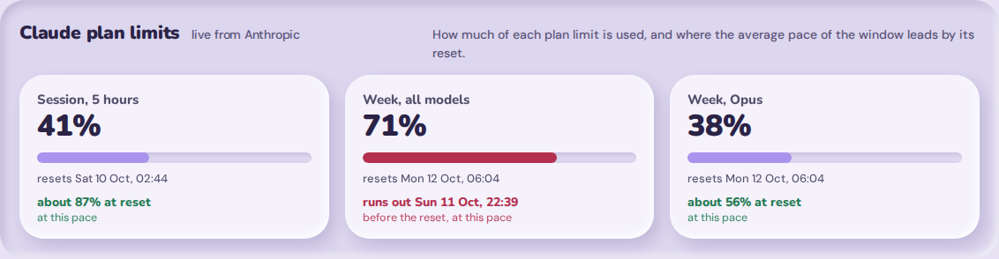

# DASHBOARD: AI TOKENS

[](https://github.com/dllfpp/ai-tokens-dashboard/releases/latest)
[](https://github.com/dllfpp/ai-tokens-dashboard/commits/main)
[](LICENSE)

A small self-hosted dashboard that shows how many tokens Claude Code uses on one machine, per
project and per conversation, by hour, day, week and month. Python standard library only, no
JavaScript, one SQLite file.



<sub>Screenshots use invented demo data (`demo/make_demo.py`), not real usage.</sub>

## What you get

- **Four readings**: this hour, today, this week and this month, each against the previous period.
- **Chart** by hour, day, week or month, stacked by project; click a bar to limit the tables to it.
- **Projects**: one per conversation group, with its own observation window (today so far, 24 h,
  48 h, 7 days, 30 days) and the latest conversation of each project; click a project to filter
  everything to it.
- **Models**: new tokens, output, cache re-reads and calls per model.
- **Conversations**: every conversation of the period, sortable by new tokens, output, calls or
  latest activity; five rows in view, the rest scroll.
- **Conversation page**: totals, hour-by-hour or day-by-day use, folders and models it touched,
  main thread against each subagent.
- **Caveman savings** (optional): what the caveman proxy removed and how output per call changed.
- Light and dark theme, works on phones, favicon, app icons and a social preview image.

| Dark theme | Phone |
|---|---|
|  |  |



## Try it with demo data

```sh
python3 -m demo.make_demo data/demo.db
TOKENDASH_DB=data/demo.db TOKENDASH_LIMITS_JSON=data/demo-limits.json CLAUDE_DIR=/nonexistent python3 -m tokendash.server
```

## Requirements

Python 3.12 or newer, nothing to install. Claude Code on the same machine (the dashboard reads its
transcripts). OpenRC only for the bundled service script; any process manager works.

## New tokens and cache re-reads

The main figure everywhere is **new tokens** = input + cache write + output: what each call adds.
Cache reads are shown beside it as "re-read from cache": every call sends the whole conversation
again, so they grow with the length of a chat and would otherwise drown the real work (a long
session can re-read tens of millions of tokens to produce a few hundred thousand new ones).

## How it counts

- **Source**: the transcripts Claude Code writes in `~/.claude/projects/**/*.jsonl` (subagents
  included). Each assistant message carries the usage of one API call; Claude Code writes it
  several times while streaming, so a call is counted once by `message.id + requestId`.
- **History**: calls are copied into SQLite (`data/usage.db`), so the history survives when Claude
  Code prunes old transcripts. Each run reads only what was appended since the last one.
- **Project**: one per conversation, never split. A conversation belongs to the repository where it
  made most calls (worktrees count as their repository); one that never left the home directory
  becomes a project of its own, named like the conversation; claude-mem note sessions stay
  together. `calls.grp` holds the group, `calls.project` the folder of each call (shown on the
  conversation page).
- **Conversation name**: CloudCLI name (if configured), job name, `/rename` title, agent name, AI
  title, first prompt.
- **Missing**: side calls that never reach the transcripts (session titles and similar), so the
  counts are a lower bound.
- **API-equivalent cost** (not on the page, only in the JSON API as `cost`): Anthropic list prices
  in `tokendash/store.py` (`PRICES`), cache write 5 min 1.25x and 1 h 2x input, fast mode 2x.
- **Time**: Central European Time, with the EU daylight-saving rule built in (works without tzdata).

## Pages

| Path | What |
|---|---|
| `/?g=hour\|day\|week\|month` | this hour, today, this week, this month against the previous one; a chart of the last 48 hours / 31 days / 12 weeks / 12 months stacked by project; projects, models, conversations |
| `&at=<bucket>` | tables limited to one bar of the chart (click a bar) |
| `&p=<project>` | everything limited to one project (click a project) |
| `&pw=today\|24h\|48h\|7d\|30d` | observation window of the Projects list only |
| `&sort=new\|output\|calls\|recent` | order of the conversations |
| `/s/<session id>` | one conversation: totals, folders and models, hour by hour or day by day, main thread and subagents |
| `/caveman` | savings from the caveman proxy and skill, if installed |
| `/api/overview`, `/api/session/<id>`, `/api/caveman` | the same data as JSON |
| `/api/report/today` | today's totals as short Telegram-ready HTML text (`{"text": ...}`) |
| `/api/report/limits` | Claude plan limits (5-hour session, week, week per model) read live from Anthropic, with a forecast, as Telegram-ready HTML text |

The server renders HTML, the chart is inline SVG with one link per bar, the page refreshes every
60 seconds.

## Optional integrations

- **CloudCLI** (web UI for Claude Code): set `CLOUDCLI_DB` to its `data/auth.db` to use the names
  given there, and `CLOUDCLI_URL` to its address to get "open in CloudCLI" links. Read only.
- **Caveman** proxy and skill: the `/caveman` page reads `~/.caveman/caveman.db` (`CAVEMAN_DB`),
  read only. Proxy: request size in tokens before and after its rewrite, measured by the proxy.
  Skill: output tokens per call in the 7 days before the proxy's first request against every
  call since: a trend, not a controlled test. Without the file the section is hidden.

## Plan limits and forecast

`/api/report/limits` asks Anthropic for the plan limits with the OAuth token Claude Code keeps in
`~/.claude/.credentials.json` (the same numbers as `/usage`). Each limit gets a straight-line forecast
at the window's average pace: the percentage expected at reset, or the time it runs out if that
comes first. No forecast in the first 5% of a window. Nothing is stored. The overview shows them in
a "Claude plan limits" box, read at most once a minute, hidden when they cannot be read.



`TOKENDASH_LIMITS_JSON` points to a saved answer to read instead of asking Anthropic (the demo
writes one). A script that polls it and
sends a chat message every 10 points, or when a forecast turns red, is easy to build on top.

## Run

```sh
python3 -m tokendash.store     # one import, prints how many calls were added
python3 -m tokendash.server    # dashboard on :3020, re-imports every 30 s
```

| Variable | Default | |
|---|---|---|
| `TOKENDASH_PORT` | `3020` | listening port |
| `TOKENDASH_DB` | `data/usage.db` | the dashboard's own database |
| `TOKENDASH_INTERVAL` | `30` | seconds between imports |
| `TOKENDASH_PUBLIC_URL` | address the browser used | absolute base for the social preview tags |
| `CLAUDE_DIR` | `~/.claude` | where Claude Code keeps its transcripts |
| `CLOUDCLI_DB`, `CLOUDCLI_URL` | empty | CloudCLI integration |
| `CAVEMAN_DB` | `~/.caveman/caveman.db` | caveman integration |

## Deploy with OpenRC

```sh
sh deploy/deploy.sh   # copies to /opt/token-dashboard, installs /etc/init.d/tokendash, restarts
```

Put local settings in `/etc/conf.d/tokendash` (`export VARIABLE=value` lines), not in the
repository. The service reads the transcripts of the user it runs as. Put it behind a reverse
proxy if it should be reachable from other machines; the dashboard itself has no login, and it
shows project names and conversation titles.

## Brand and design

Claymorphism ("Argilla"): every colour and size token sits at the top of `tokendash/ui/style.css`,
the page in `tokendash/ui/view.py`. Logo, favicons, app icons, social preview (1200×630) and web
manifest are in `tokendash/ui/static/`; sources and build scripts in `brand/` (`mark.svg`,
`og.html`, `build_logo.py` with fontTools, `render.js` with Playwright, `make_ico.py`). Asset URLs
carry `?v=<content hash>`, so browsers pick up a new version at once.

## License

MIT, see [LICENSE](LICENSE).

Made with love ❤️ - DLLFPP ([buymeacoffee.com/dllfpp](https://buymeacoffee.com/dllfpp))
